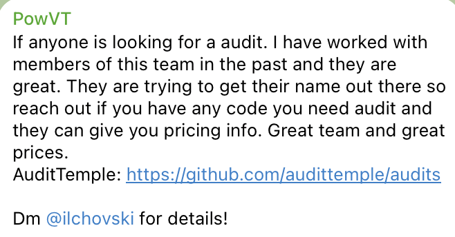
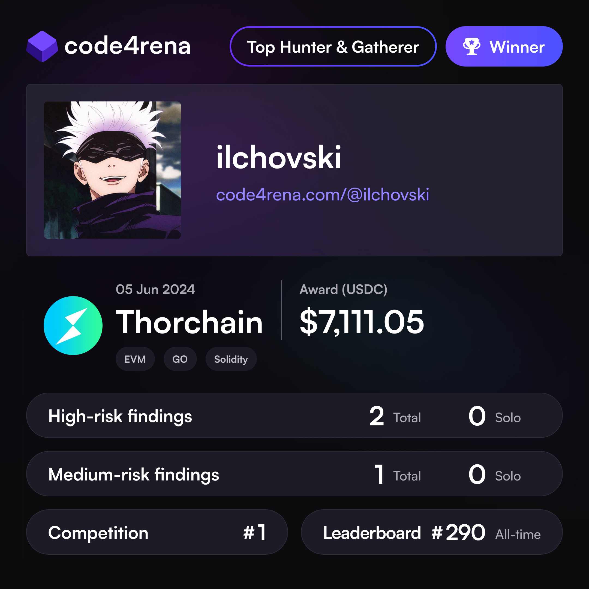
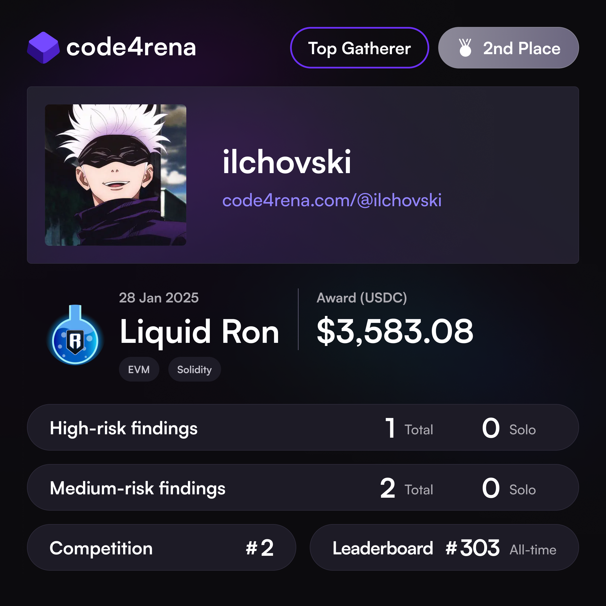
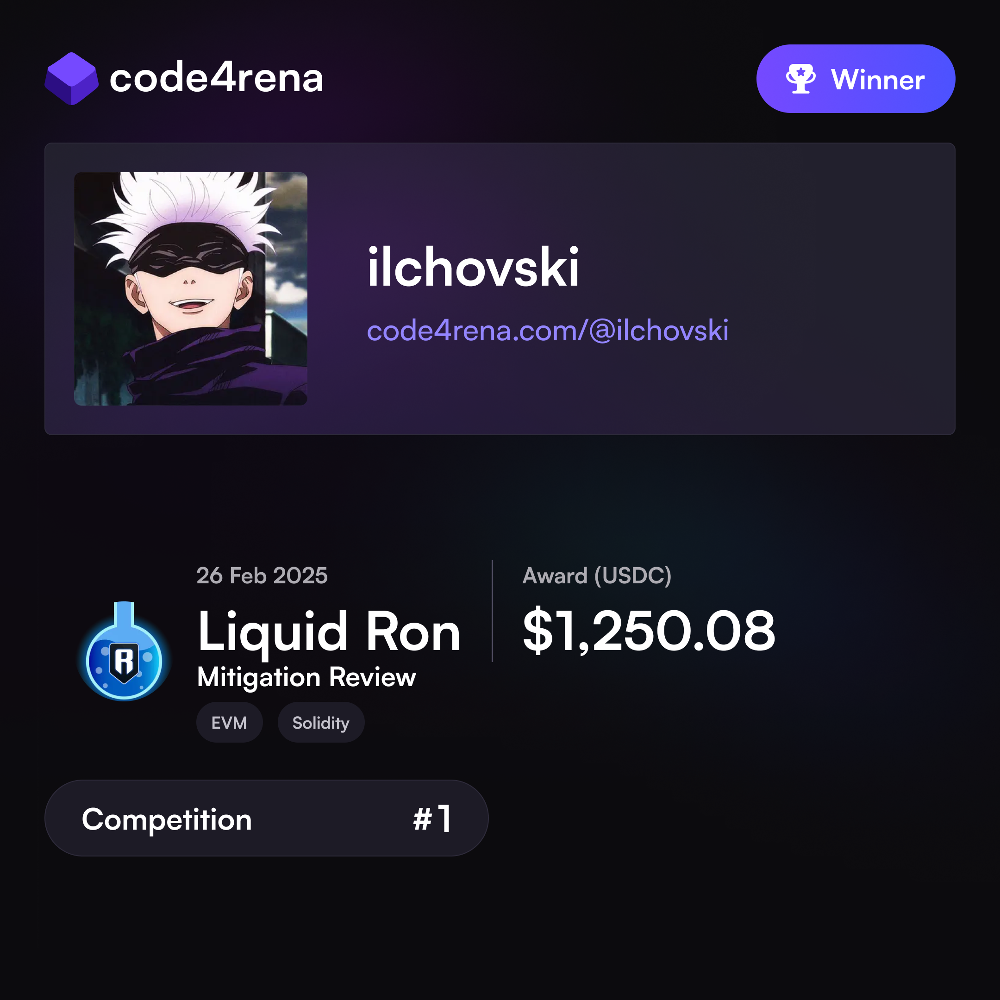

# About me 🥷

An independent security researcher with great attention to detail that loves to break down complexity and offer easy practical solutions. 

Currently a **Lead Security Researcher** at Paladin Blockchain Security.

**Secured 40+ Defi/Cross-Chain protocols** and has multiple top 1-10 finishes in competitive audits.

With more than 3 years of experience in the blockchain industry I provide value to protocols in the form of smart contract security reviews and consultations. 

Ex-employee of the second largest blockchain development company in Bulgaria - Limechain.

# Book an audit 📩

If you're looking to get your protocol secured and have a reliable partner to guide you in the process, you can reach out at 👇 
- [Twitter](https://x.com/ilchovski98)
- [Telegram](https://t.me/ilchovski)

# 🛡️ Private Audits 🛡️
| Client                                                                 | Report | Type              | Date |
| :----------------------------------------------------------------------- | :---------------------------- | --- | --- |
| Chainport   | Soon | Cross-Chain Bridge, UniV2/UniV3              |  May 2025            | | 
| LayerZero Aptos ULN301 Extension   | - | Aptos Move, LayerZero              |  May 2025            | | 
| LayerZero OneSig Extension | - | Merkle Tree              | April 2025             |  |
| LayerZero Aptos ULN301   | - | Aptos Move, LayerZero              |  April 2025            | | 
| LayerZero HyperEVM   | [PDF](./reports/HyperLiquid-Composer-Security-Review.pdf) | LayerZero, HyperEVM  | April 2025             | |
| SingularityDAO DynaRouter  | Soon |    BalancerV2        |  March 2025             | |
| SingularityDAO DynaLiquidity   | Soon | BalancerV2  |  March 2025            |  |
| LayerZero OneSig   | - | Merkle Tree  |  March 2025            |  |
| Gamma Strategies   | Soon | UniV4, Limit orders  |  March 2025            |  |
| Dragonswap   | Soon | Lending, Order book  |  February 2025            | |
| Beraji-KO  | [PDF](./reports/Beraji-KO-Security-Review.pdf)| Staking  |  February 2025            |  |
| Yuga Labs  | [PDF](./reports/YugaLabs-Security-Review.pdf)| LayerZero, NFT  |  February 2025            |  |
| Surge - TitanX  | [PDF](./reports/Surge-TitanX-Security-Review.pdf)| Staking, UniV2, UniV3  |  January 2025            |  |
| Berabot  | [PDF](./reports/Berabot-Security-Review.pdf)| DEX Aggregator, UniV2, UniV3  |  January 2025            |  |
| USDT0  | [PDF](./reports/USDT0-Security-Review.pdf)| LayerZero  |  January 2025            |  |
| LayerZero   | - | Aptos Move, LayerZero  |  November 2024            |  |
| LayerZero EVM WAB  | - | LayerZero  |  November 2024            |  |
| LayerZero MintAndBurnWithFee EUROP  | - | LayerZero  |  November 2024            |  |
| SolvBTC OFT | [PDF](./reports/LayerZero-SolvBTC-Security-Review.pdf)| LayerZero  |  November 2024            |  |
| Betswirl  | [PDF](./reports/Betswirl-B2B-Security-Review.pdf)| Betting Platform  |  November 2024            |  |
| Suzaku  | [PDF](./reports/Suzaku-Security-Review.pdf)| Avalanche ICTT  |  October 2024            |  |
| Vincask  | [PDF](./reports/Vincask-Security-Review.pdf)| NFT  |  October 2024            |  |
| Derive  | [PDF](./reports/Derive-Security-Review.pdf)| DeFi, Lending / Borrowing, Options  |  October 2024            |  |
| Hypercycle  | [PDF](./reports/HyperCycle-Security-Review.pdf)| AI, Node  |  July 2024            |  |
| Arcade.xyz  | [PDF](./reports/Arcade-Security-Review.xyz.md)| NFT Lending  |  May 2024            |  |
| Paytr | [PDF](./reports/Paytr-Security-Review.md) | Compound  |  May 2024            |  |

# 🏆 Testimonials & Wins 🏆

  
  

  
  
  

# 🥇 Audit Contests 🥇

| Protocol                                                                 | Type              | Findings| Date | Report                                                                                     |
| :----------------------------------------------------------------------- | :---------------------------- | :------------------------- |--- |:--------------------------------------------------------------------------------------------- |
| Liquid Ron Mitigation  | Liquid Staking Automation  | -  | March 2025            | [Open](https://code4rena.com/audits/2025-02-liquid-ron-mitigation-review) |
| Liquid Ron  | Liquid Staking Automation  | 1H 2M  | February 2025            | [Open](https://code4rena.com/audits/2025-01-liquid-ron) |
| TraitForge  | NFT Game  | 4H 2M  | August 2024            | [Open](./audits/contests/TraitForge.md) |
| Zaros Part 1  | Perpetuals DEX  | 1H 4M 5L  | 07.2024            | [Open](./audits/contests/Zaros-part-1.md) |
| Size   | Lending, Order book  | 1H 3M  | July 2024            | [Open](./audits/contests/Size.md)|
| Thorchain   | DEX  | 2H 1M  | June 2024            | [Open](./audits/contests/Thorchain.md) |
| Munchables   | Game, Staking  | 1H  | May 2024            | [Open](./audits/contests/Munchables.md) |
| Renzo   | Upgradeability, Staking, EigenLayer  | 4H 4M  | May 2024            | [Open](./audits/contests/Renzo.md) |
| Zivoe   | RWA Credit              | 2H 2M  | April 2024             | [Open](./audits/contests/Zivoe.md)|
| DittoETH   | Stablecoin, Order book              | 1H 1M  | April 2024             | [Open](./audits/contests/DittoETH.md)|
| reNFT   | NFT, Lending              | 3M  | January 2024            | [Open](./audits/contests/reNFT.md)| 
| NextGen  | NFT              | 1H  | November 2023             | [Open](./audits/contests/NextGen.md) |
